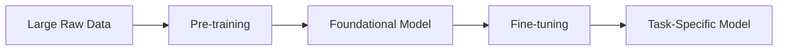

# Introduction

Hello everyone, welcome to the third lecture in the **“Building Large Language Models from Scratch”** series.

In the previous lectures, we covered:

- Basics of large language models (LLMs)  
- Key terminology (AI, ML, Deep Learning, Generative AI)  
- Applications of LLMs  

In this lecture, we will focus on the **stages involved in building large language models**.

---

## Lecture Overview

This lecture introduces:

- The two main stages of building LLMs:
  - Pre-training  
  - Fine-tuning  
- Supporting concepts:
  - Data requirements  
  - Computational cost  
  - Training workflow  

---

## Two Stages of Building LLMs

There are two primary stages:

1. **Pre-training**  
2. **Fine-tuning**  

---

## Pre-training

### Definition

Pre-training means:

> Training a model on a **large and diverse dataset**

---

### Why Pre-training Works

LLMs are effective because:

- They are trained on **massive datasets**  
- They learn statistical patterns of language  
- They capture relationships between words and concepts  

Example (GPT-3):

- ~175 billion parameters  
- Trained on hundreds of billions of tokens  

---

### Data Sources

Typical large-scale datasets include:

- Common Crawl (internet-scale data)  
- WebText (Reddit, blogs, articles)  
- Books  
- Wikipedia  

---

### Key Training Objective

LLMs are trained using:

> **Next-word prediction**

Example:

Input:  
“The lion is in the”

Target (next word):  
“forest”

---

### Important Detail — Self-Supervised Learning

Pre-training is:

> **Self-supervised**

This means:

- No external labels are provided  
- The dataset itself provides supervision  

Explanation:

- Input = part of the sentence  
- Label = next word in the sentence  

👉 The model learns from the structure of the data itself  

---

### Emergent Capabilities

Even though the model is trained only for next-word prediction, it can perform:

- Translation  
- Question answering  
- Summarization  
- Sentiment analysis  

---

### Key Insight

> Complex capabilities emerge from a simple training objective

This phenomenon is known as:

> **Emergent behavior**

---

## Fine-tuning

### Definition

Fine-tuning means:

> Further training a pre-trained model on a **smaller, task-specific dataset**

---

### Why Fine-tuning is Needed

Pre-trained models are:

- General-purpose  
- Not specialized for specific domains  

---

### Examples

- Airline chatbot → trained on airline-specific data  
- Legal assistant → trained on legal documents  
- Banking system → trained on financial data  

---

### Key Idea

- Pre-training → general knowledge  
- Fine-tuning → domain-specific expertise  

---

## Pre-training vs Fine-tuning

---

## Data Requirements

### Pre-training

- Uses **unlabeled data**  
- Very large datasets (billions/trillions of tokens)  

---

### Fine-tuning

- Uses **labeled data**  
- Smaller, domain-specific datasets  

---

## Computational Cost

Pre-training is extremely expensive.

Example:

- GPT-3 pre-training cost ≈ **$4.6 million**

Reasons:

- Massive datasets  
- Large parameter count  
- Extensive GPU usage  
- Long training duration  

---

## Training Workflow

### Step 1 — Data Collection

- Internet text  
- Books  
- Articles  
- Media  

---

### Step 2 — Pre-training

- Train model on raw text  
- Predict next word  
- Learn language patterns  

---

### Step 3 — Fine-tuning

- Train on labeled data  
- Adapt to specific tasks  

---

## Types of Fine-tuning

### 1. Instruction Fine-tuning

- Input-output pairs  
- Example-driven learning  

Example:

- Input → English sentence  
- Output → French translation  

---

### 2. Classification Fine-tuning

- Labeled datasets  

Example:

- Email → spam / not spam  

---

## Important Distinction

### Pre-training

- Self-supervised  
- No manual labels required  

---

### Fine-tuning

- Supervised  
- Requires labeled data  

---

## Key Concepts Recap

- LLMs are trained in two stages:
  - Pre-training  
  - Fine-tuning  

- Pre-training:
  - Large-scale  
  - General-purpose  
  - Self-supervised  

- Fine-tuning:
  - Task-specific  
  - Uses labeled data  
  - Improves performance  

---

## Final Insight

- Pre-trained models = powerful but generic  
- Fine-tuned models = specialized and production-ready  

---

## Next Lecture

In the next lecture:

- Introduction to Transformers  
- Foundations of modern LLM architecture  

---

Thank you, and see you in the next lecture.