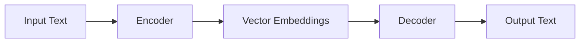

# Introduction

Hello everyone, welcome to Lecture 4 in the **“Building Large Language Models from Scratch”** series.

In the previous lecture, we explored the two stages of building an LLM:

- Pre-training  
- Fine-tuning  

In this lecture, we introduce a fundamental concept behind modern LLMs:

> **Transformers**

---

## Lecture Objective

This lecture provides a **basic introduction to Transformers**.

We will cover:

- What Transformers are  
- Their historical context  
- Their role in LLMs  
- Key concepts:
  - Tokenization  
  - Embeddings  
  - Encoder and decoder  
- High-level architecture overview  

> Note: This lecture focuses on **intuition and conceptual understanding**, not detailed mathematics or implementation.

---

## The Importance of Transformers

Transformers are the **core architecture behind modern LLMs**.

- Most large language models rely on Transformers  
- They are the key reason for the success of models like GPT  

---

## Historical Background

Transformers were introduced in the 2017 paper:

> **“Attention Is All You Need”**

Key facts:

- Introduced by researchers at Google  
- Over 100,000 citations  
- Represented a major breakthrough in deep learning and NLP  

---

## Original Purpose of Transformers

The original Transformer architecture was designed for:

- **Machine translation**

Examples:

- English → German  
- English → French  

Important:

- Text generation (like GPT) was **not the original goal**  
- Generation capabilities emerged later  

---

## Transformer Architecture (High-Level)

A Transformer consists of two main components:

- Encoder  
- Decoder  

---

## Step-by-Step Transformer Workflow

A simplified Transformer operates through a sequence of steps.

---

### Step 1 — Input Text

- Input sentence is provided (e.g., English text)

---

### Step 2 — Tokenization

Definition:

> Tokenization = splitting text into smaller units (tokens)

Example:

Fine tuning is fun for all  

→ Tokens:

- Fine  
- tuning  
- is  
- fun  
- for  
- all  

Each token is assigned a unique ID.

---

### Step 3 — Encoder

- Receives tokenized input  
- Converts tokens into internal representations  

Important:

- Encoder processes the **entire input sequence**  
- Captures relationships between tokens  

---

### Step 4 — Embeddings

Definition:

> Embeddings = numerical vector representations of tokens

Key idea:

- Words with similar meaning → similar vectors  

Examples:

- dog, puppy → close together  
- apple, banana → close together  
- football, tennis → close together  

---

### Step 5 — Partial Output Generation

The model begins generating output:

> **One word at a time**

Important:

- Output is generated sequentially  
- At any step, only the next word is predicted  

---

### Step 6 — Decoder Input

The decoder receives:

- Embeddings from encoder  
- Previously generated output tokens  

Important:

- Decoder uses both:
  - input understanding  
  - generated context  

---

### Step 7 — Next Word Prediction

The decoder predicts:

> The next word in the sequence

This prediction is based on:

- input context  
- previously generated words  

---

### Step 8 — Iterative Generation

The process repeats:

- Predicted word is appended  
- New sequence becomes input  
- Next word is predicted  

👉 This continues until the sequence is complete  

---

### Step 9 — Final Output

- Complete output sequence is generated  
- Example: translated sentence  

---

## Key Insight — Sequential Generation

Transformers (especially GPT-style models):

> Generate output **one word at a time**

Important properties:

- Iterative process  
- Each prediction depends on previous outputs  
- This behavior leads to **autoregressive generation**  

---

## Encoder vs Decoder

### Encoder

- Converts input text → embeddings  
- Processes full sequence  
- Captures semantic meaning  

---

### Decoder

- Generates output text  
- Uses:
  - embeddings  
  - previous outputs  

---

## GPT vs Transformer

Important distinction:

- Transformer:
  - Encoder + Decoder  

- GPT:
  - Decoder only  

👉 GPT simplifies the architecture by removing the encoder  

---

## Self-Attention Mechanism

A key innovation in Transformers is:

> **Self-attention**

---

### What is Self-Attention?

Self-attention allows the model to:

- Assign importance to different words  
- Capture relationships between words  

---

### Key Idea

Not all words contribute equally.

- Some words are more important for prediction  
- The model assigns **weights** to tokens  

---

### Long-Range Dependency

Definition:

> Ability to use context from distant tokens in a sequence  

Important:

- Context may come from:
  - earlier words  
  - earlier sentences  

---

### What Self-Attention Does

- Computes relationships across tokens  
- Assigns importance scores  
- Enables context-aware predictions  

---

## Why “Attention Is All You Need”?

Because:

- Attention enables:
  - Context understanding  
  - Long-range dependency modeling  
  - Efficient sequence processing  

---

## Transformer Components

A Transformer includes:

- Encoder block  
- Decoder block  
- Attention layers  
- Feedforward layers  

---

## BERT vs GPT

### BERT

- Full form:
  - Bidirectional Encoder Representations from Transformers  

- Characteristics:
  - Uses encoder only  
  - Predicts masked words  
  - Looks both left and right  

---

### GPT

- Full form:
  - Generative Pre-trained Transformer  

- Characteristics:
  - Uses decoder only  
  - Predicts next word  
  - Left-to-right generation  

---

### Key Difference

- BERT → understanding  
- GPT → generation  

---

## Transformers vs LLMs

### Not all Transformers are LLMs

Transformers can be used for:

- Text  
- Images (Vision Transformers)  

---

### Not all LLMs are Transformers

Before Transformers:

- RNN (Recurrent Neural Networks)  
- LSTM (Long Short-Term Memory)  

These were also used for language modeling.

---

## Key Takeaways

- Transformers are the foundation of modern LLMs  
- Introduced in 2017  
- Built around encoder-decoder architecture  
- Use self-attention mechanism  
- Enable context-aware predictions  
- Generate output iteratively  

---

## Final Recap

- Input → tokenization → embeddings  
- Encoder processes full input  
- Decoder generates output step by step  
- Each word prediction depends on previous context  
- Self-attention captures relationships across tokens  

---

## Next Lecture

In the next lecture:

- Deeper dive into Transformer components  
- More detailed understanding of attention  

---

Thank you, and see you in the next lecture.