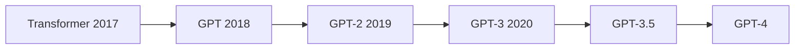
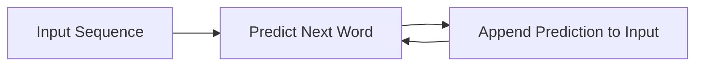

# Introduction

Hello everyone, welcome to Lecture 5 in the **“Building Large Language Models from Scratch”** series.

In this lecture, we will study:

- The evolution of GPT models  
- The progression from Transformers → GPT → GPT-2 → GPT-3 → GPT-4  
- The concept of zero-shot vs few-shot learning  
- Datasets used for GPT training  
- Core training principles (next-word prediction, autoregression)  
- Emergent behavior in LLMs  

---

## Evolution of GPT Models

### Transformer (2017)

The foundational paper:

> **“Attention Is All You Need”**

Key contribution:

- Introduced the **self-attention mechanism**  
- Enabled modeling of long-range dependencies  
- Replaced RNNs and LSTMs as dominant sequence models  

Architecture:

- Encoder + Decoder  

---

### GPT (2018)

Introduced **Generative Pre-trained Transformer**

Key ideas:

- Unsupervised (self-supervised) learning on unlabeled text  
- Next-word prediction as training objective  
- Labels are derived from the data itself  

Important shift:

- Uses **decoder-only architecture**  
- Removes encoder component  

Key concept:

> Generative pre-training = learning language structure from large unlabeled text  

---

### GPT-2 (2019)

Advancements:

- Larger datasets  
- Larger models  
- Improved generalization  

Variants:

- Small  
- Medium  
- Large  
- Extra Large (~1.5B parameters)  

Key insight:

- Increasing scale improves performance  

---

### GPT-3 (2020)

Major breakthrough:

- 175 billion parameters  
- Trained on massive datasets (~300B tokens)  
- Demonstrated strong generalization across tasks  

Capabilities:

- Translation  
- Question answering  
- Summarization  
- Reasoning  
- Text generation  

Important observation:

> A model trained only for next-word prediction can perform many different tasks  

---

### GPT-3.5 and GPT-4

- GPT-3.5: widely adopted commercially  
- GPT-4: current advanced model  

Key observation:

- Rapid progress from 2017 → present  
- Performance increases with scale, data, and training improvements  

---

## Model Evolution Summary

---

## Zero-Shot vs Few-Shot Learning

### Zero-Shot Learning

Definition:

> Performing a task without any prior examples

Example:

- Input: “Translate ‘cheese’ to French”  
- Model outputs translation directly  

Key idea:

- Model generalizes from pre-training alone  

---

### One-Shot Learning

- Model is given **one example** before performing the task  

---

### Few-Shot Learning

Definition:

> Learning from a small number of examples

Example:

- Provide multiple translation examples  
- Model uses them to infer the pattern  

---

### Key Insight

- GPT models perform best with **few-shot learning**  
- They can also perform **zero-shot learning**, but:
  - performance is often improved with examples  

---

### Important Clarification

- Few-shot learning improves:
  - accuracy  
  - consistency  
- Zero-shot relies purely on:
  - generalization from training  

---

## Dataset for GPT Training

GPT-3 uses large-scale datasets.

### Data Sources

- **Common Crawl** (~60%)  
  - Web-scale scraped data  
  - Hundreds of billions of tokens  

- **WebText**  
  - Reddit-linked content  
  - High-quality curated text  

- **Books**  
- **Wikipedia**  

---

### Scale

- ~300 billion tokens  

Important:

> A token is a unit of text processed by the model  

Simplification:

- 1 token ≈ 1 word (approximation only)  

---

### Key Insight

- Large datasets enable:
  - pattern learning  
  - generalization  
  - emergent capabilities  

---

## Pre-training Cost

- GPT-3 training cost ≈ **$4.6 million**

Reasons:

- Massive datasets  
- Large parameter count  
- GPU-intensive computation  
- Long training cycles  

---

## GPT Architecture

### Key Property

- **Decoder-only architecture**

Difference from Transformer:

- Transformer → Encoder + Decoder  
- GPT → Decoder only  

---

## Next Word Prediction

GPT models are trained to:

> Predict the next word in a sequence

Example:

Input:  
“The lion is in the”

Output:  
“forest”

---

## Training Process (Autoregressive)

---

### Key Properties

- **Autoregressive**
  - Previous output becomes next input  

- **Self-supervised learning**
  - Labels come from the data itself  

---

## Why Unsupervised / Self-Supervised?

- No external labels required  
- Sentence structure provides:
  - input  
  - target (next word)  

---

## Model Training Intuition

Process:

1. Input sequence is given  
2. Model predicts next word  
3. Compare prediction with actual next word  
4. Compute error  
5. Update model weights  

---

### Important Detail

- This process is repeated for:
  - billions of tokens  
  - millions of sequences  

- This explains:
  - high computational cost  
  - long training time  

---

## Emergent Behavior

### Definition

> Ability of a model to perform tasks it was not explicitly trained for

---

### Examples

Even though trained only for next-word prediction, GPT can:

- Translate languages  
- Generate MCQs  
- Summarize text  
- Answer questions  
- Perform reasoning tasks  

---

### Key Insight

- Complex capabilities emerge from a simple objective:
  
> next-word prediction  

---

### Important Observation

- Emergent behavior is:
  - not explicitly programmed  
  - not directly trained  
  - still not fully understood  

---

## Open Source vs Closed Source Models

- **Closed-source** (e.g., GPT-4)
  - Model weights not publicly available  

- **Open-source** (e.g., LLaMA models)
  - Weights and architecture available  

Trend:

- Performance gap is decreasing  
- Open-source models are becoming competitive  

---

## Key Takeaways

- GPT evolved from Transformer architecture  
- Uses decoder-only design  
- Trained via next-word prediction  
- Autoregressive and self-supervised  
- Shows emergent behavior  
- Performs best with few-shot learning  

---

## Final Thought

Even though GPT models are trained for a simple task:

> Predicting the next word

They develop powerful capabilities across a wide range of applications.

---

## Next Lecture

In the next lecture:

- Stages of building an LLM  
- Transition toward hands-on implementation  

---

Thank you, and see you in the next lecture.