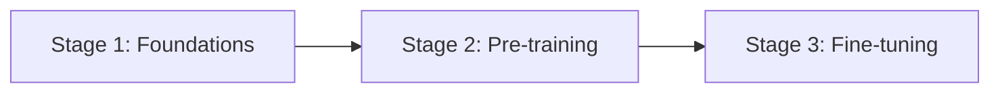
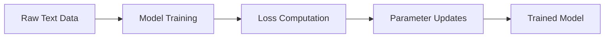
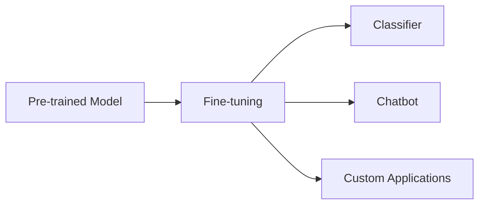

# Introduction

Hello everyone, welcome to this lecture in the **“Building Large Language Models from Scratch”** series.

So far, we have covered multiple lectures focusing on:

- Fundamental concepts  
- Transformer architecture  
- GPT evolution  
- Pre-training and fine-tuning  
- Key terminology and intuition  

In this lecture, we will define a **clear roadmap** for the rest of the course and outline the stages involved in building a large language model.

---

## Lecture Objective

This lecture aims to:

- Provide a roadmap for the course  
- Define the stages of building an LLM  
- Explain what will be covered in each stage  
- Prepare for the transition from theory to hands-on implementation  

---

## Why This Lecture Matters

The lecturer emphasizes an important point:

- Many existing resources:
  - cover only parts of the pipeline  
  - skip important stages  
  - do not explain details deeply  

As a result:

- Learners often:
  - understand only applications  
  - lack understanding of internal mechanisms  

---

### Key Motivation

> The goal of this course is to cover **all stages in detail**, without skipping concepts.

---

## Course Structure Overview

The course is divided into **three main stages**:

---

## Stage 1 — Foundations

### Objective

Understand the fundamental building blocks of large language models.

---

### Key Areas

Stage 1 focuses on:

- Data preparation  
- Attention mechanism  
- LLM architecture  

---

### 1. Data Preparation and Sampling

Includes:

- Tokenization  
- Converting text into tokens  
- Data preprocessing  
- Data batching  
- Context windows  

Important:

- Raw text must be processed before training  
- Data must be structured for efficient computation  

---

### 2. Vector Embeddings

- Convert tokens into vectors  
- Represent semantic meaning  

Example idea:

- Similar words → closer in vector space  

---

### 3. Positional Encoding

- Captures order of words in a sequence  
- Necessary because models process tokens in parallel  

---

### 4. Attention Mechanism

Includes:

- Self-attention  
- Key, Query, Value  
- Attention scores  

Important:

- Enables understanding of relationships between tokens  

---

### 5. Model Architecture

- Structure of LLMs  
- Layer stacking  
- Transformer blocks  

---

### Outcome of Stage 1

- Strong conceptual understanding  
- Ability to implement core components  
- Preparation for training stage  

---

## Stage 2 — Pre-training

### Objective

Train a large language model on raw text data.

---

### Key Concept

> Pre-training produces a **foundational model** using unlabeled data

---

### Training Workflow

---

### Details

#### 1. Training Process

- Feed tokenized data  
- Predict next word  
- Compute loss  
- Update model parameters  

---

#### 2. Training Loop

- Iterative learning  
- Multiple epochs  
- Optimization process  

---

#### 3. Model Evaluation

- Training loss  
- Validation loss  
- Sample text generation  

---

#### 4. Model Persistence

- Save model weights  
- Load model weights  
- Continue training  

Important:

> Training from scratch every time is inefficient — saving weights is essential  

---

#### 5. Using Pre-trained Models

- Load existing weights  
- Build on top of them  
- Avoid repeating expensive training  

---

## Stage 3 — Fine-tuning

### Objective

Adapt the pre-trained model to specific tasks.

---

### Why Fine-tuning is Necessary

- Pre-trained models are general  
- Real-world applications require specialization  

---

### Example Applications

---

### Use Cases

- Spam vs non-spam classification  
- Chatbots  
- Domain-specific assistants  

---

### Types of Fine-tuning

#### 1. Instruction Fine-tuning

- Input-output pairs  
- Task-specific examples  

---

#### 2. Classification Fine-tuning

- Labeled datasets  
- Category prediction  

---

### Key Insight

- Requires **labeled data**  
- Produces **task-specific models**  

---

## Critical Learning Warning

The lecturer highlights a common mistake:

- Many learners:
  - Skip fundamentals  
  - Jump directly to tools (e.g., LangChain)  
  - Focus only on applications  

---

### Consequence

- Shallow understanding  
- Lack of confidence  
- Inability to explain concepts  

---

### Correct Learning Approach

1. Learn fundamentals  
2. Understand architecture  
3. Train models  
4. Then build applications  

---

## Course Philosophy

This course emphasizes:

- First-principles understanding  
- Deep conceptual clarity  
- Step-by-step progression  
- Theory + implementation  

---

## Learning Approach

- Visual explanations (whiteboard style)  
- Hands-on coding  
- Gradual increase in complexity  

---

## Recap of Previous Learnings

So far, we have learned:

- LLM fundamentals  
- Transformer architecture  
- GPT evolution  
- Pre-training vs fine-tuning  
- Attention mechanism basics  

---

## What Comes Next

From the next lecture onward:

- Begin **hands-on implementation**  
- Work with real datasets  
- Start coding LLM components  

---

## Transition to Practice

Upcoming topics include:

- Loading datasets  
- Counting tokens  
- Tokenization in practice  
- Initial coding exercises  

---

## Final Thought

This lecture marks the transition:

> From theory → to implementation

---

## Closing

Thank you for following along in this series.

We now begin the practical journey of building large language models step by step.

---