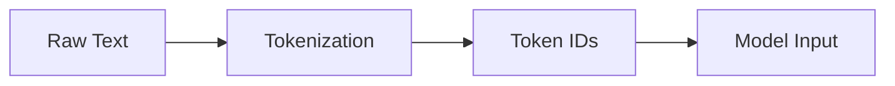

# Introduction

Hello everyone, welcome to Lecture 7 in the **“Building Large Language Models from Scratch”** series.

In this lecture, we begin the **hands-on phase** of the course.

So far, we have covered:

- Concepts  
- Architectures  
- Theory behind LLMs  

From this lecture onward, we will start working with **real data and code**.

---

## Lecture Objective

This lecture focuses on:

- Working with raw text data  
- Understanding tokenization in practice  
- Preparing data for model training  
- Initial coding steps  

---

## Transition to Hands-On Learning

This lecture marks a key transition:

> From conceptual understanding → to implementation

We will begin:

- Writing code  
- Handling datasets  
- Preparing inputs for LLM training  

---

## Working with Text Data

### What is Text Data?

Text data refers to:

- Documents  
- Articles  
- Books  
- Any form of written content  

Before training an LLM, we must:

- Load the data  
- Process the data  
- Convert it into a usable format  

---

## Data Preparation Workflow

### Key Steps (as demonstrated)

1. Load dataset  
2. Inspect content  
3. Count characters  
4. Understand structure  
5. Apply tokenization  

---

## Tokenization (Concept)

Tokenization is the process of:

> Breaking text into smaller units called tokens

---

### Example

Input text:

The quick brown fox jumps over the lazy dog  

Tokenized:

- The  
- quick  
- brown  
- fox  
- jumps  
- over  
- the  
- lazy  
- dog  

---

### Important Clarification

Tokens are **not always words**.

They can be:

- Words  
- Subwords  
- Characters  
- Symbols  

---

## Code Demonstration — Tokenization

The lecturer demonstrates code for:

- Loading a dataset  
- Reading text into memory  
- Counting total number of characters  
- Printing sample portions of text  
- Applying tokenization  
- Creating token lists from raw text  

```python
# === CODE PLACEHOLDER ===
# Topic: Dataset loading and initial text processing
# Status: Partial / missing from transcript
# Notes:
# - File is opened and read into a variable (e.g., raw_text)
# - Character count is computed (e.g., len(raw_text))
# - Sample text is printed for inspection
# ========================
```

---

## Character-Level Tokenization

One approach demonstrated:

- Treat each **character** as a token  
- Convert characters into numerical IDs  

Example idea:

- 'a' → 1  
- 'b' → 2  
- 'c' → 3  

This is a simplified representation of tokenization.

---

## Vocabulary Construction

To process text, we must build a **vocabulary**.

### Steps:

1. Extract all unique tokens  
2. Sort tokens (typically alphabetical order)  
3. Assign each token a unique ID  
4. Build mappings:
   - token → ID  
   - ID → token  

```python
# === CODE PLACEHOLDER ===
# Topic: Vocabulary construction and token-ID mapping
# Status: Partial / missing from transcript
# Notes:
# - Unique tokens extracted from dataset
# - Tokens sorted and enumerated
# - Dictionary created for token → ID mapping
# - Reverse mapping (ID → token) also constructed
# ========================
```

---

## Encoding Text

Text is converted into numerical representation:

> Models cannot process raw text directly

Example:

- Input text → tokens  
- Tokens → numerical IDs  

---

## Decoding Text

Reverse process:

- Token IDs → tokens  
- Tokens → readable text  

This step is necessary to interpret model outputs.

---

## Data Pipeline Overview



---

## Context Length

Another important concept introduced:

### Definition

> Context window = number of tokens the model considers at a time

---

## Sliding Window Training

During training:

- Input = sequence of tokens  
- Output = next token  

Example idea:

- Input: first N tokens  
- Output: token N+1  

---

## Special Tokens (Critical Section)

The lecture explicitly introduces **special tokens**, which are essential in real LLM pipelines.

---

### 1. End-of-Text Token

Example:

- `<|endoftext|>`

Purpose:

- Marks the **end of a sequence**
- Separates different text sources during training  

---

### 2. Unknown Token

Example:

- `<|unk|>`

Purpose:

- Represents words **not present in the vocabulary**
- Prevents errors when unseen words are encountered  

---

### 3. Additional Tokens (General NLP Context)

The lecturer also mentions:

- `[BOS]` — Beginning of Sequence  
- `[EOS]` — End of Sequence  
- `[PAD]` — Padding token  

---

### Important Distinction

- GPT-style models primarily use:
  - `<|endoftext|>`

- Other NLP systems may use:
  - `[BOS]`, `[EOS]`, `[PAD]`, `<|unk|>`

Understanding these differences is important for:

- Model design  
- Training pipelines  
- Implementation details  

---

## Code Demonstration — Special Token Handling

The lecturer explains how special tokens are integrated into the vocabulary and encoding process.

```python
# === CODE PLACEHOLDER ===
# Topic: Handling special tokens in tokenizer
# Status: Partial / missing from transcript
# Notes:
# - Vocabulary extended with:
#   - <|endoftext|>
#   - <|unk|>
# - Unknown words mapped to <|unk|> token ID
# - End-of-text token inserted between sequences
# ========================
```

---

## Key Insight

Machine learning models require:

- Numerical input  
- Structured representation  

Tokenization enables this transformation.

---

## Key Takeaways

- Text must be converted into tokens  
- Tokens must be mapped to numerical IDs  
- Vocabulary defines token-ID relationships  
- Special tokens are essential in real systems  
- Tokenization is the **first step in LLM pipelines**  

---

## Final Thought

This lecture begins the practical journey of:

> Converting raw text into structured numerical input

---

## Next Lecture

In the next lecture:

- Deeper exploration of tokenization  
- Advanced techniques  
- Continued coding implementation  

---

Thank you, and see you in the next lecture.