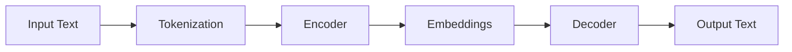

# Introduction

Hello everyone, welcome to this lecture in the **“Building Large Language Models from Scratch”** series.

In the previous lecture, we discussed:

- The two stages of building an LLM:
  - Pre-training  
  - Fine-tuning  

In this lecture, we introduce one of the most important concepts in modern LLMs:

> **Transformers**

---

## Lecture Objective

In this lecture, we will cover:

- What Transformers are  
- Their historical origin  
- Their role in LLMs  
- Key components:
  - Tokenization  
  - Embeddings  
  - Encoder and Decoder  
- Self-attention mechanism  
- Differences between:
  - Transformers and LLMs  
  - BERT and GPT  

---

## Transformers — The Core of LLMs

Transformers are the **key architecture behind modern large language models**.

- Most LLMs rely on Transformers  
- They are the “secret sauce” behind LLM performance  

---

## Historical Background

Transformers were introduced in the 2017 paper:

> **“Attention Is All You Need”**

Key facts:

- Introduced by researchers at Google  
- Over 100,000 citations  
- Revolutionized NLP  

---

## Original Purpose

Transformers were initially designed for:

- **Machine translation**

Examples:

- English → German  
- English → French  

Important note:

- Text generation (like GPT) came later  

---

## Transformer Architecture Overview

A Transformer consists of:

- Encoder  
- Decoder  

---

## Step-by-Step Transformer Workflow

A simplified Transformer operates in **multiple sequential steps**.

---

### Step 1 — Input Text

- Input sentence (e.g., English text)

---

### Step 2 — Tokenization

Definition:

> Tokenization = breaking text into smaller units (tokens)

Example:

Fine tuning is fun for all  

→ Tokens:
- Fine  
- tuning  
- is  
- fun  
- for  
- all  

Each token is assigned a unique ID.

---

### Step 3 — Encoder

- Receives tokenized input  
- Converts tokens into internal representations  

---

### Step 4 — Embeddings

Definition:

> Embeddings = vector representations capturing meaning

Key idea:

- Similar words → similar vectors  

Examples:

- dog, puppy → close  
- apple, banana → close  
- football, tennis → close  

---

### Step 5 — Partial Output Generation

The model generates output:

> **One word at a time**

Important:

- Output is generated sequentially  
- At each step, only the next word is predicted  

---

### Step 6 — Decoder Input

The decoder receives:

- Embeddings from encoder  
- Previously generated output tokens  

---

### Step 7 — Next Word Prediction

The decoder predicts:

> The next word in the sequence

This process is repeated iteratively.

---

### Step 8 — Final Output

- Complete output sequence is generated  
- Example: translated sentence  

---

## Key Insight — Autoregressive Generation

Transformers (in GPT-style models) generate output:

> **One word at a time**

Important properties:

- Each predicted word becomes part of the next input  
- The process is iterative  
- This behavior is called **autoregressive generation**  

---

## Encoder vs Decoder

### Encoder

- Converts input text → embeddings  
- Captures semantic meaning  
- Processes entire input sequence  

---

### Decoder

- Generates output text  
- Uses:
  - embeddings  
  - previously generated tokens  

---

## GPT vs Transformer

Important distinction:

- Transformer:
  - Encoder + Decoder  

- GPT:
  - Decoder only  

👉 GPT removes the encoder and relies entirely on the decoder for generation.

---

## Self-Attention Mechanism

### Definition

Self-attention allows the model to:

- Weigh importance of different words  
- Capture relationships between words  

---

### Key Idea

Not all words are equally important.

- Some words influence prediction more than others  
- The model assigns **importance weights**  

---

### Long-Range Dependency

Definition:

> Ability to use context from distant words in a sequence  

Important:

- Context may come from:
  - earlier parts of the sentence  
  - previous sentences  

---

### What Self-Attention Does

- Assigns importance scores to tokens  
- Captures relationships across the sequence  
- Enables context-aware predictions  

---

## Why “Attention Is All You Need”?

Because:

- Attention enables:
  - Context awareness  
  - Long-range dependency modeling  
  - Better sequence understanding  

---

## Transformer Components

A Transformer consists of:

- Encoder block  
- Decoder block  
- Attention layers  
- Feedforward layers  

---

## BERT vs GPT

### BERT

- Full form:
  - Bidirectional Encoder Representations from Transformers  

- Characteristics:
  - Uses encoder only  
  - Predicts masked words  
  - Looks at both directions  

---

### GPT

- Full form:
  - Generative Pre-trained Transformer  

- Characteristics:
  - Uses decoder only  
  - Predicts next word  
  - Left-to-right generation  

---

### Key Difference

- BERT → understanding  
- GPT → generation  

---

## Transformers vs LLMs

### Not all Transformers are LLMs

Transformers can be used for:

- Text  
- Image processing (Vision Transformers)  

---

### Not all LLMs are Transformers

Earlier architectures:

- RNN (Recurrent Neural Networks)  
- LSTM (Long Short-Term Memory)  

These were also used for language modeling.

---

## Key Takeaways

- Transformers are the foundation of modern LLMs  
- Introduced in 2017  
- Based on encoder-decoder architecture  
- Use self-attention mechanism  
- Enable context-aware predictions  
- Generate output one word at a time  

---

## Final Recap

- Input → tokenization → embeddings  
- Encoder processes input  
- Decoder generates output  
- Output generated iteratively  
- Self-attention captures relationships across tokens  

---

## Next Lecture

In the next lecture:

- Further exploration of Transformer components  
- Deeper understanding of attention  

---

Thank you, and see you in the next lecture.