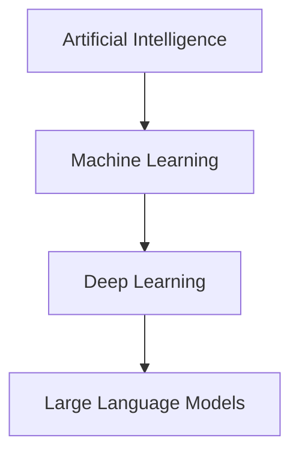

# Markdown Output Rules — LLM Course Project

## Purpose

Define a consistent standard for all Markdown outputs generated in this project.

These rules ensure:

* readability
* consistency
* compatibility across tools (VS Code, GitHub, etc.)
* easy copy/paste and reuse

---

## General Rules

1. Output must be contained in a **single Markdown block**
2. No content should appear outside the block
3. Avoid non-standard Markdown extensions (e.g., `id=...`)
4. Output must be directly copy-pasteable into a `.md` file

---

## File Structure

Each lecture file must follow this structure:

```
---
title: <lecture title>
source: <original filename>
cleaned_on: <YYYY-MM-DD>
---

# Title

## Section

Content...
```

---

## Headings

* Use clear hierarchy:

  * `#` → title
  * `##` → main sections
  * `###` → subsections

* Do NOT skip levels

---

## Text Formatting

* Use bullet points for lists
* Use short paragraphs (max 4–5 lines)
* Avoid unnecessary verbosity
* Preserve original meaning (Stage 1 constraint)

---

## Code and Examples

* Avoid nested triple backticks
* Prefer inline examples when simple

Example:

The lion is in the ___ → forest

---

## 🧩 Code Placeholder Formatting (CRITICAL)

When code is missing or partially captured:

* Insert a Python code block
* Place it immediately after the related explanation

Use this exact format:

````
```python
# === CODE PLACEHOLDER ===
# Topic: <description>
# Status: Missing / Partial
# Notes:
# - Key steps demonstrated
# ========================
```
````

Rules:

* Do NOT invent code
* Do NOT modify structure
* Keep wording concise and factual

---

## Diagrams

### Standard

Use **Mermaid diagrams** when structure adds value.

Example:

````

````

---

### When to Use Mermaid

Use for:

* hierarchies
* pipelines
* architectures
* workflows

Do NOT use for:

* simple lists
* trivial structures

---

## Mermaid Rules

* Must remain inside the main Markdown block
* Do NOT nest code blocks
* Keep diagrams simple and readable

---

## Technical Detail Preservation

* Do NOT collapse or simplify technical content
* Explicitly preserve:

  * tokens
  * parameters
  * structured lists

Example:

Correct:

* `<|endoftext|>, <|unk|>, [BOS], [EOS], [PAD]`

Incorrect:

* “special tokens”

---

## Extended Notes Formatting

When clarification is needed:

Use:

**Note:** <content>

or

**Important:** <content>

---

## Consistency Rules

* Use consistent terminology across lectures
* Maintain uniform section structure
* Apply same formatting patterns everywhere

---

## Stage 1 Constraints (Critical)

* Do NOT add new knowledge
* Do NOT reorganize content across lectures
* Do NOT summarize or omit key content

Only:

* clean
* structure
* clarify

---

## Validation Checklist

Before finalizing any file:

* [ ] Single Markdown block
* [ ] No rendering issues
* [ ] Metadata present
* [ ] Headings correctly structured
* [ ] Mermaid (if used) renders correctly
* [ ] Code placeholders correctly formatted
* [ ] No content outside block

---
